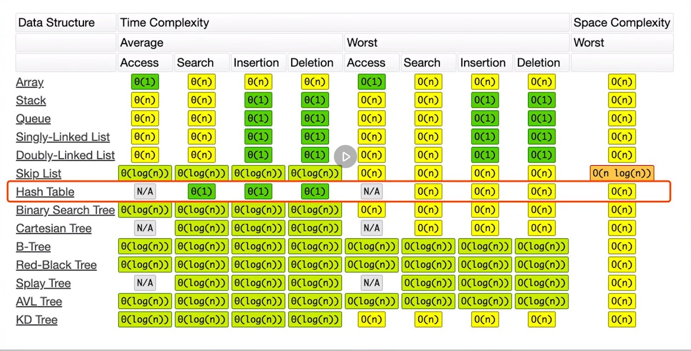

<!--
 * @Author: your name
 * @Date: 2020-04-26 09:19:54
 * @LastEditTime: 2020-04-26 09:22:28
 * @LastEditors: Please set LastEditors
 * @Description: In User Settings Edit
 * @FilePath: \algorithm008-class02\Week_02\NOTE.md
 -->
### 第二周大纲

- 哈希表，映射集合

- 树，二叉树，二叉搜索树的概念
- 堆和二叉堆，优先级队列的概念

#### 哈希表应用

1. 在C++中，哈希表实现的形式是unordered_map，unordered_set, unordered_multimap,unordered_multiset这四种关联容器，其背后都是以哈希表的形式实现的。multi是允许存在多个相同的键值。
2. 哈希表的应用主要在统计频次上，[leetcode-242有效的字母异位词](https://leetcode-cn.com/problems/valid-anagram/description/)等问题。需要将数组中的出现的元素次数进行统计，这类问题都要优先考虑使用哈希表来以空间换时间解决。因为哈希表的查找和插入都是O(1)的时间。
3. 注意unordered_set 和 unordered_map不同，unordered_set中只是存储键，并没有对应的data，而unordered_map是存储的键值对，即一个键值对应一个data。同理map 和 set也是关联容器，只不过他们底层是rb-tree来实现的。

参考例题：

​	[字母异位词分组](https://leetcode-cn.com/problems/group-anagrams/)

#### 树，二叉树，二叉搜索树

1. 树的概念不用过多赘述，通过本节内容，学习到了解决树的问题可以多考虑递归来尝试，有时候递归并不一定是比较差的选择。
2. 二叉树最基本的知识就是前序，中序，后序遍历，包括他们的递归和非递归的写法。这里都统一总结：[二叉树的前序，中序，后序遍历](http://note.youdao.com/noteshare?id=289d91337b0d0792b20f32e02eb50403&sub=C8714445B92148C299D7CB137E11AEC2)
3. 树的大部分习题很多解法都是采用递归的解法，递归是解决重复性问题的优先解法。这样做的原因是树本身就是由一颗颗子树嵌套子树构成的，当我们解决了子树的问题，自然也就慢慢解决了整棵树的问题。

参考例题：

​	[树的直径](https://leetcode-cn.com/problems/diameter-of-binary-tree/)

​	[树的最大深度](https://leetcode-cn.com/problems/maximum-depth-of-binary-tree/)

#### 堆和二叉堆

1. 堆是计算机科学中一类特殊的数据结构，其可以看成是一棵完全二叉树的数组对象。满足以下性质：

   - 堆中每个结点的值总是不大于或不小于其父节点的值
   - 堆总是一棵完全二叉树
   - 根节点最大的堆是大顶堆，根节点最小的是小顶堆。常见的堆有二叉堆，斐波那契堆等。我们常用的就是二叉堆。
   - 堆是一个一维数组构成的，但是是非线性结构。数组中的元素都有两个直接后继。
   - 由于堆有log(n)层深，插入结点、删除普通元素和删除最小元素的平均时间代价和时间复杂度都是O(logn)
2. C++ STL中采用priority_queue来使用二叉堆解决一些常见的高频问题。优先级队列的底层是二叉堆，如果是大顶堆，那么队列中的元素会自底向上的进行排序，将最大的元素调整到堆顶 。小顶堆相反。如果要从队列中取出最大的值后，先将队列最后一个元素放到堆顶，然后在自顶向下进行调整即可。

3. 优先级队列常用来解决  [最小的k个数](https://leetcode-cn.com/problems/zui-xiao-de-kge-shu-lcof/)，这类找出第k个最小或者最大的数。

​	参考例题：

​		[前k个高频单词](https://leetcode-cn.com/problems/top-k-frequent-elements/)

​		[丑数II](http://note.youdao.com/noteshare?id=978db923d32754f6c62ce53a63ac2116&sub=9F97D0BE5A5F4EBD9794A82A4733D905)

#### 图的实现和特性

1. 关于图主要就是深度优先遍历，广度优先遍历，以及拓扑排序。在以后详细讨论。